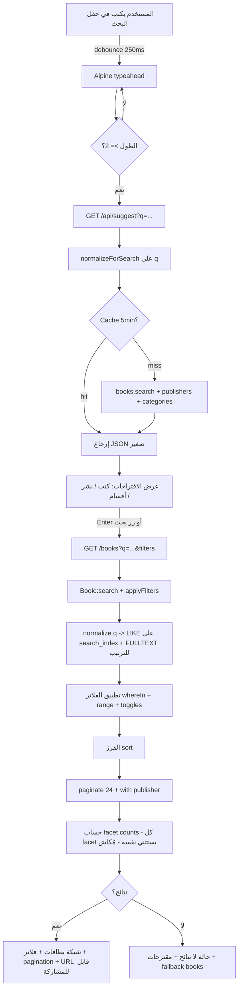

<div dir="rtl" markdown="1">

# محرك البحث والفلترة الاحترافي وكيان دار النشر (Search &amp; Publisher)

| البند | القيمة |
|---|---|
| **المشروع** | منصة قصص أطفال — `qasaqis.store` |
| **العلامة** | «قصص أطفال» (كتب أطفال منسّقة/مطبوعة جاهزة) |
| **نوع المستند** | وثيقة تصميم تقني — Technical Design Document |
| **رقم المستند** | 06 |
| **الوحدة** | Search Engine + Faceted Filters + Publisher Entity |
| **الحزمة التقنية** | Laravel 11 (PHP 8.2+) · MySQL 8 (InnoDB) · Blade + Tailwind + Alpine.js · Filament v3 · Hostinger + Cloudflare |
| **التاريخ** | 2026-07-14 |

---

## 0) الملخّص التنفيذي (Executive Summary)

هذا المستند يعرّف مكوّنين مترابطين في المنصّة:

1. **محرك بحث وفلترة احترافي** يعمل بدقّة عالية على النص العربي (اسم الكتاب، دار النشر، المؤلف، الرسّام) عبر **تطبيع عربي (Arabic Normalization)** مُسبق مخزّن في عمود `search_index`، مدعومًا بـ **FULLTEXT (InnoDB, ngram)** للترتيب بالصلة، و**اقتراح فوري (Autocomplete)** خفيف بـ Alpine.js، وفلاتر متقدّمة (Faceted Filters) بعدّادات، وصفحة نتائج قابلة للفهرسة (SEO-friendly).

2. **كيان دار النشر (Publisher)** ككيان أول-درجة له جدول وعلاقة مع الكتب وصفحة عامة مفهرسة ولوحة إدارة في Filament وseeder يربط الكتب الحالية بدور النشر الحقيقية.

> [!NOTE]
> **قرار معماري رئيسي:** على استضافة **Hostinger المشتركة** لا نعتمد على **Scout + Meilisearch/Algolia** (تحتاج daemon أو خدمة خارجية = تكلفة وتعقيد). بحجم الكتالوج الحالي (**23 كتابًا**، ومئات لاحقًا) الحل الأمثل والأرخص والأكثر توافقًا هو **عمود `search_index` مطبّع + `LIKE` عليه + `FULLTEXT ngram` للترتيب**. مشكلة العربية ليست في المحرّك بل في **التطبيع** (الهمزات / التشكيل / «ال» التعريف)؛ فإذا خُزّن النص مطبّعًا مسبقًا صار حتى `LIKE '%...%'` دقيقًا وسريعًا جدًا على هذا الحجم، وتجنّبنا هشاشة FULLTEXT العربي و collation المتذبذب على الاستضافة المشتركة.

---

## القسم الأول — محرك البحث والفلترة

## 1) البحث النصي الاحترافي + التطبيع العربي (Arabic Normalization)

### 1.1 دالة التطبيع (Single Source of Truth)

مصدر واحد للحقيقة يُستخدم في الفهرسة وفي مدخل المستخدم معًا، فيضمن التطابق في الاتجاهين.

```php
// app/Support/ArabicNormalizer.php
class ArabicNormalizer
{
    public static function normalize(?string $text): string
    {
        if (! $text) {
            return '';
        }

        $t = mb_strtolower(trim($text), 'UTF-8');

        // 1) إزالة التشكيل (الحركات + الشدة + التطويل / Tatweel)
        $t = preg_replace('/[\x{0617}-\x{061A}\x{064B}-\x{0652}\x{0640}]/u', '', $t);

        // 2) توحيد الهمزات والحروف المتشابهة
        $map = [
            'أ' => 'ا', 'إ' => 'ا', 'آ' => 'ا', 'ٱ' => 'ا',
            'ة' => 'ه',
            'ى' => 'ي', 'ئ' => 'ي',
            'ؤ' => 'و',
            'ی' => 'ي', 'ک' => 'ك', // محارف فارسية شائعة بالنسخ/اللصق
        ];
        $t = strtr($t, $map);

        // 3) توحيد المسافات
        $t = preg_replace('/\s+/u', ' ', $t);

        return trim($t);
    }

    // نسخة للبحث: تُسقط «ال» التعريف من بداية كل كلمة
    public static function normalizeForSearch(?string $text): string
    {
        $t = self::normalize($text);
        $t = preg_replace('/(^|\s)ال(\S)/u', '$1$2', $t);

        return trim($t);
    }
}
```

> [!NOTE]
> نطبّق `normalize()` عند **تخزين** `search_index`، ونطبّق `normalizeForSearch()` (التي تُسقط «ال») على **مدخل المستخدم**. ولضمان التطابق في الاتجاهين نُخزّن أيضًا نسخة العنوان بلا «ال» داخل نفس العمود.

### 1.2 مخطّط الجدول والفهارس

```sql
ALTER TABLE books
  ADD COLUMN search_index TEXT NULL AFTER slug,
  ADD FULLTEXT INDEX ft_books_search (search_index) WITH PARSER ngram;
```

يُبنى `search_index` بدمج كل الحقول القابلة للبحث **بعد تطبيعها** (مع تكرار نسخة العنوان بلا «ال»):

```
[اسم الكتاب] + [اسم الكتاب بلا ال] + [دار النشر] + [المؤلف] + [الرسّام] + [كلمات مفتاحية/tags]
```

### 1.3 بناء العمود عبر Observer

يُبنى تلقائيًا عند كل حفظ، فأي كتاب جديد يظهر في البحث فورًا دون خطوة يدوية.

```php
// app/Observers/BookObserver.php
class BookObserver
{
    public function saving(Book $book): void
    {
        $book->search_index    = $this->buildIndex($book);
        $book->effective_price = $book->sale_price ?? $book->price; // انظر 3.2
    }

    private function buildIndex(Book $book): string
    {
        $parts = [
            $book->title,
            $book->author_name,
            $book->illustrator_name,
            $book->publisher?->name,
            $book->tags, // نص أو implode
        ];

        return collect($parts)
            ->filter()
            ->map(fn ($p) => ArabicNormalizer::normalize($p))
            ->push(ArabicNormalizer::normalizeForSearch($book->title)) // نسخة بلا «ال»
            ->unique()
            ->implode(' ');
    }
}
```

> [!TIP]
> عند تغيير اسم الناشر، يُعاد بناء `search_index` للكتب المرتبطة عبر `PublisherObserver@saved` → `Book::where('publisher_id', $id)->each->save()`. بحجم الكتالوج الحالي التحديث المباشر مقبول. لملء البيانات القديمة: migration بسيطة `Book::chunk(100, fn ($c) => $c->each->save())`.

### 1.4 استعلام البحث الهجين (دقة LIKE + ترتيب FULLTEXT)

```php
public function scopeSearch(Builder $q, ?string $term): Builder
{
    $term = ArabicNormalizer::normalizeForSearch($term);
    if ($term === '') {
        return $q;
    }

    // تقسيم لكلمات ومطابقة AND (كل كلمة يجب أن تظهر)
    $words = array_filter(explode(' ', $term));

    return $q->where(function (Builder $sub) use ($words) {
            foreach ($words as $w) {
                $sub->where('search_index', 'LIKE', '%'.$w.'%');
            }
        })
        // ترتيب بالصلة: تطابق البداية أولًا ثم FULLTEXT score
        ->orderByRaw('CASE WHEN search_index LIKE ? THEN 0 ELSE 1 END', [$term.'%'])
        ->orderByRaw(
            'MATCH(search_index) AGAINST(? IN BOOLEAN MODE) DESC',
            [$this->booleanExpr($words)]
        );
}

private function booleanExpr(array $words): string
{
    return collect($words)->map(fn ($w) => '+'.$w.'*')->implode(' ');
}
```

المكافئ بلغة SQL للتوضيح:

```sql
SELECT id, title
FROM books
WHERE search_index LIKE '%كتاب%'
  AND search_index LIKE '%علوم%'
  AND is_published = 1
ORDER BY
  (search_index LIKE 'كتاب علوم%') DESC,
  MATCH(search_index) AGAINST('+كتاب* +علوم*' IN BOOLEAN MODE) DESC
LIMIT 24;
```

> [!NOTE]
> **لماذا الهجين؟** `LIKE` على النص المطبّع يضمن الدقّة ويحلّ مشكلة العربية 100%، و`FULLTEXT/ngram` يعطي ترتيبًا جيدًا بالصلة. على نطاق 23–500 كتاب الأداء لحظي.

### 1.5 مقارنة الحلول (توصية صريحة)

| الحل | دقة العربية | سرعة الإعداد | ملاءمة Hostinger | التوصية |
|---|---|---|---|---|
| `LIKE` مباشر على الأعمدة الخام | ضعيفة (الهمزات/«ال») | فورية | ممتازة | ❌ |
| **`search_index` مطبّع + `LIKE` + `FULLTEXT ngram`** | **عالية جدًا** | متوسطة | **ممتازة** | ✅ **الموصى به** |
| `FULLTEXT` عربي بدون تطبيع | متوسطة/هشّة | متوسطة | متذبذبة | ⚠️ |
| Scout + Meilisearch/Algolia | ممتازة | عالية | سيئة (daemon/API) | ❌ لهذا الحجم |
| Scout + `database` driver | = LIKE | فورية | ممتازة | غلاف ممكن، لكن التطبيع اليدوي أدق |

---

## 2) الاقتراح الفوري (Autocomplete / Typeahead)

### 2.1 الـ Endpoint

```
GET /api/suggest?q=كتب+عل
```

```json
{
  "books":      [{ "id": 12, "title": "كتاب العلوم الممتع", "slug": "...", "cover": "...", "price": 180 }],
  "publishers": [{ "id": 3, "name": "دار الشروق", "slug": "dar-alshorouk" }],
  "categories": [{ "id": 2, "name": "كتب علمية", "slug": "science", "count": 5 }]
}
```

```php
// routes/api.php
Route::get('/suggest', SuggestController::class)->middleware('throttle:60,1');

class SuggestController
{
    public function __invoke(Request $r)
    {
        $q = ArabicNormalizer::normalizeForSearch($r->query('q', ''));
        if (mb_strlen($q) < 2) {
            return response()->json(['books' => [], 'publishers' => [], 'categories' => []]);
        }

        $key = 'suggest:'.md5($q);

        return Cache::remember($key, now()->addMinutes(5), fn () => [
            'books' => Book::published()->search($q)
                ->select('id', 'title', 'slug', 'cover_path', 'price', 'sale_price')
                ->limit(6)->get(),
            'publishers' => Publisher::whereRaw('name_index LIKE ?', ["%{$q}%"])
                ->select('id', 'name', 'slug')->limit(3)->get(),
            'categories' => Category::whereRaw('name_index LIKE ?', ["%{$q}%"])
                ->withCount('publishedBooks')->limit(3)->get(),
        ]);
    }
}
```

### 2.2 مكوّن Alpine.js (خفيف · debounce · إلغاء الطلب السابق)

```html
<div x-data="typeahead()" @click.away="open = false" class="relative">
  <input type="search" x-model="q" @input.debounce.250ms="fetchResults()"
         @focus="open = true" placeholder="ابحث عن كتاب أو دار نشر أو مؤلف…"
         class="w-full h-12 rounded-xl ps-11 pe-4 text-base" dir="rtl">

  <div x-show="open && (books.length || publishers.length || categories.length)"
       x-transition class="absolute z-50 mt-2 w-full bg-white rounded-xl shadow-lg divide-y">
    <template x-if="books.length">
      <div class="p-2">
        <p class="px-2 py-1 text-xs text-gray-400">كتب</p>
        <template x-for="b in books" :key="b.id">
          <a :href="`/books/${b.slug}`" class="flex gap-3 items-center p-2 hover:bg-gray-50 rounded-lg">
            
            <span x-text="b.title" class="text-sm"></span>
          </a>
        </template>
      </div>
    </template>
    <!-- publishers + categories بنفس النمط -->
  </div>
</div>

<script>
function typeahead () {
  return {
    q: '', open: false, books: [], publishers: [], categories: [], ctrl: null,
    async fetchResults () {
      if (this.q.trim().length < 2) { this.books = this.publishers = this.categories = []; return }
      this.ctrl?.abort(); this.ctrl = new AbortController()
      try {
        const res = await fetch(`/api/suggest?q=${encodeURIComponent(this.q)}`, { signal: this.ctrl.signal })
        const d = await res.json()
        this.books = d.books; this.publishers = d.publishers; this.categories = d.categories; this.open = true
      } catch (e) { /* aborted */ }
    }
  }
}
</script>
```

> [!IMPORTANT]
> النقاط الحرجة على **الإنترنت الضعيف**: `debounce.250ms`، و`AbortController` لإلغاء الطلبات المتراكمة، وحدّ أدنى حرفين، وردّ JSON صغير (حقول مختارة فقط)، وكاش 5 دقائق للـ endpoint.

---

## 3) الفلترة المتقدمة (Faceted Filters)

### 3.1 الفلاتر والفرز

الأقسام الستة كلها تُعرض حتى الفارغة حاليًا (روايات 0، طفولة مبكرة 0)، بينما تُعطَّل بصريًا الخيارات التي عدّادها صفر عند اقترانها بفلاتر أخرى.

| الفلتر | النوع | Query param |
|---|---|---|
| القسم (Category) | multi (checkbox) | `cat[]=2&cat[]=5` |
| دار النشر (Publisher) | multi | `pub[]=3` |
| الفئة العمرية (Age) | multi | `age[]=3-6` |
| السعر (Price) | range slider (150–450) | `min=150&max=300` |
| العروض/الخصم (Sale) | toggle | `sale=1` |
| المميّز (Featured) | toggle | `featured=1` |
| التوفّر (In stock) | toggle | `stock=1` |
| الفرز (Sort) | select | `sort=newest\|price_asc\|price_desc\|best\|rating` |
| بحث (Search) | text | `q=...` |
| صفحة (Page) | int | `page=2` |

### 3.2 استعلام الفلترة مع عدّادات الـ Facets

```php
public function index(Request $r)
{
    $base = Book::query()->published()->with('publisher:id,name,slug');

    // البحث النصي
    $base->when($r->q, fn ($q) => $q->search($r->q));

    // استعلام فلترة قابل لإعادة الاستخدام لحساب facet counts
    $applyFilters = function (Builder $q, array $except = []) use ($r) {
        if (! in_array('cat', $except) && $r->cat) {
            $q->whereIn('category_id', (array) $r->cat);
        }
        if (! in_array('pub', $except) && $r->pub) {
            $q->whereIn('publisher_id', (array) $r->pub);
        }
        if (! in_array('age', $except) && $r->age) {
            $q->whereIn('age_group', (array) $r->age);
        }
        if ($r->filled('min')) $q->where('effective_price', '>=', (int) $r->min);
        if ($r->filled('max')) $q->where('effective_price', '<=', (int) $r->max);
        if ($r->boolean('sale'))     $q->whereNotNull('sale_price');
        if ($r->boolean('featured')) $q->where('is_featured', 1);
        if ($r->boolean('stock'))    $q->where('stock', '>', 0);

        return $q;
    };

    $applyFilters($base);

    // الفرز
    $base->when($r->sort, fn ($q, $s) => match ($s) {
        'price_asc'  => $q->orderBy('effective_price'),
        'price_desc' => $q->orderByDesc('effective_price'),
        'best'       => $q->orderByDesc('sales_count'),
        'rating'     => $q->orderByDesc('rating_avg'),
        default      => $q->latest('published_at'),
    }, fn ($q) => $r->q ? $q : $q->latest('published_at'));

    $books = $base->paginate(24)->withQueryString();

    // عدّادات الـ facets (كل facet يستثني نفسه — سلوك متجر احترافي)
    $facets = Cache::remember('facets:'.md5($r->fullUrl()), 300, fn () => [
        'categories' => $this->facetCount('category_id',  $applyFilters, ['cat'], $r),
        'publishers' => $this->facetCount('publisher_id', $applyFilters, ['pub'], $r),
        'ages'       => $this->facetCount('age_group',    $applyFilters, ['age'], $r),
    ]);

    return view('catalog.index', compact('books', 'facets'));
}

private function facetCount(string $col, callable $filters, array $except, $r): array
{
    return $filters(Book::published(), $except)
        ->when($r->q, fn ($qq) => $qq->search($r->q))
        ->groupBy($col)
        ->selectRaw("{$col}, COUNT(*) as c")
        ->pluck('c', $col)->toArray();
}
```

> [!NOTE]
> **`effective_price`**: عمود محسوب مخزّن `= COALESCE(sale_price, price)` يُملأ في `BookObserver`. يجعل فلترة/فرز السعر فهرسًا واحدًا بسيطًا بدل شروط `COALESCE` على الطيران. (يخدم أيضًا الأسعار المشطوبة في نطاق 150–450 ج.م).

> [!NOTE]
> **«كل facet يستثني نفسه»**: عند عرض عدد كل قسم لا نطبّق فلتر الأقسام المختار (وإلّا ظهرت أصفار). هذا سلوك المتاجر الاحترافية — يرى المستخدم «كم نتيجة لو أضاف هذا الخيار».

عرض الخيار مع العدد:

```blade
@foreach ($categories as $cat)
  <label class="flex items-center gap-2 py-2 {{ ($facets['categories'][$cat->id] ?? 0) == 0 ? 'opacity-40' : '' }}">
    <input type="checkbox" name="cat[]" value="{{ $cat->id }}"
           @checked(in_array($cat->id, (array) request('cat')))>
    <span>{{ $cat->name }}</span>
    <span class="text-xs text-gray-400 ms-auto">({{ $facets['categories'][$cat->id] ?? 0 }})</span>
  </label>
@endforeach
```

---

## 4) صفحة النتائج القابلة للفهرسة (SEO-friendly Results Page)

- **URL قابل للمشاركة والفهرسة:** كل الحالة في query params، و`->withQueryString()` يحفظ الفلاتر عبر الـ pagination. مثال: `/books?cat[]=2&pub[]=3&sale=1&sort=price_asc&page=2`.
- **SEO:** للصفحات > 1 أضِف `<link rel="canonical">` للنسخة الأساسية، و`rel="prev/next"`. صفحة القسم بدون فلاتر تبقى الأساس للفهرسة.
- **حفظ حالة الفلاتر:** النموذج يُعيد ملء نفسه من `request()`. زر «مسح الكل» يذهب للمسار بدون params.
- **Pagination خفيف:** `simplePaginate(24)` (بلا `COUNT` كامل) إن أردت الأخف، أو `paginate` مع كاش العدّاد.
- **البطاقات (Cards):** غلاف lazy، العنوان، الناشر، السعر (مع شطب السعر القديم عند الخصم)، شارة «مميّز/خصم»، زر إضافة للسلة.

> [!WARNING]
> **حالات بيانات معروفة في الكتالوج:** `BOOK1` «أنا لستُ شقيًا!» بلا سعر — يُخفى من الشبكة أو يُعرض «غير متوفر للطلب» حتى يضيف الأدمن السعر. `BOOK10` «هون عليك» بلا صورة غلاف — تُعرض صورة placeholder («قصص أطفال») حتى يرفع الأدمن الغلاف. لا يجوز أن يكسر أيّ منهما شبكة النتائج.

### 4.1 حالة «لا نتائج» بمقترحات

```blade
@if ($books->isEmpty())
  <div class="text-center py-16">
    <p class="text-lg">لا توجد نتائج لبحثك @if (request('q')) عن «{{ request('q') }}» @endif</p>
    <ul class="mt-4 text-sm text-gray-500 space-y-1">
      <li>• جرّب كلمات أقل أو أعمّ</li>
      <li>• تأكّد من الإملاء</li>
      <li>• أزِل بعض الفلاتر</li>
    </ul>
    <div class="mt-8">
      <p class="mb-3 font-medium">قد يعجبك أيضًا</p>
      @include('catalog._grid', ['books' => $fallbackBooks])
    </div>
  </div>
@endif
```

---

## 5) الأداء (Performance)

### 5.1 الفهارس المطلوبة

```sql
-- بحث نصي
ALTER TABLE books ADD FULLTEXT ft_books_search (search_index) WITH PARSER ngram;

-- فلترة/فرز (composite تراعي is_published أولًا)
ALTER TABLE books ADD INDEX idx_cat   (is_published, category_id, effective_price);
ALTER TABLE books ADD INDEX idx_pub   (is_published, publisher_id);
ALTER TABLE books ADD INDEX idx_age   (is_published, age_group);
ALTER TABLE books ADD INDEX idx_price (is_published, effective_price);
ALTER TABLE books ADD INDEX idx_new   (is_published, published_at);
ALTER TABLE books ADD INDEX idx_sale  (is_published, sale_price);
ALTER TABLE books ADD INDEX idx_best  (is_published, sales_count);

-- أعمدة تطبيع الناشر/القسم للـ autocomplete
ALTER TABLE publishers ADD COLUMN name_index VARCHAR(255), ADD INDEX idx_pub_name (name_index);
ALTER TABLE categories ADD COLUMN name_index VARCHAR(255), ADD INDEX idx_cat_name (name_index);
```

### 5.2 منع N+1 والكاش

- `with('publisher:id,name,slug')` دائمًا في قائمة النتائج.
- `select()` بالحقول اللازمة فقط للبطاقات (لا تُحمّل `description`/`search_index` في القوائم).
- **كاش الـ facets** 5 دقائق بمفتاح مبني على الـ query. على Hostinger افتراضيًا `cache driver = file/database`، لذلك بدل `Cache::tags` استخدم **مفتاح إصدار**: `Cache::forever('catalog_version', now()->timestamp)` وادمجه في مفاتيح الكاش، وحدّثه عند أي حفظ كتاب/ناشر — أبسط وأمتن من tags.
- **حجم استجابة صغير:** JSON الـ suggest بحقول قليلة، وGzip/Brotli عبر Cloudflare مفعّل، وأغلفة WebP + `loading="lazy"` + أحجام responsive.
- **تحميل كسول للنتائج:** زر «تحميل المزيد» يجلب الصفحة التالية عبر Alpine ويضيفها للشبكة (بدل reload كامل) — أخف على الشبكة الضعيفة:

```html
<button x-data @click="$dispatch('load-more')" x-show="hasMore">تحميل المزيد</button>
```

### 5.3 نقاط Hostinger خاصة

- تأكّد أن الجداول **InnoDB** (شرط FULLTEXT الحديث + المعاملات).
- `ngram` parser مدعوم في MySQL 5.7+/8. تحقّق: `SHOW VARIABLES LIKE 'ngram_token_size';` (الافتراضي 2 مناسب للعربية).
- استخدم `strict => true` في `config/database.php`، وأدر الكاش عبر التطبيق لا عبر `query_cache` في MySQL (أُزيل في 8).

---

## 6) تجربة الموبايل (Mobile-first)

- **الهيدر:** أيقونة بحث بارزة (48px) تفتح شاشة بحث كاملة (full-screen overlay) مع الـ typeahead — لا حقل مصغّر.
- **Bottom Sheet للفلاتر:** زر عائم «الفلاتر (٣)» يعرض عدد الفلاتر النشطة، يفتح شيتًا منزلقًا من الأسفل:

```html
<div x-data="{ open: false }">
  <button @click="open = true"
          class="fixed bottom-4 inset-x-4 h-12 rounded-full bg-primary text-white shadow-lg z-40">
    الفلاتر @if ($activeCount) <span class="bg-white/25 rounded-full px-2">{{ $activeCount }}</span> @endif
  </button>

  <div x-show="open" x-transition.opacity class="fixed inset-0 bg-black/40 z-50" @click="open = false"></div>
  <div x-show="open" x-transition:enter="translate-y-full" x-transition:enter-end="translate-y-0"
       class="fixed bottom-0 inset-x-0 max-h-[85vh] overflow-y-auto bg-white rounded-t-2xl z-50 p-4" dir="rtl">
    <div class="w-10 h-1.5 bg-gray-300 rounded-full mx-auto mb-4"></div>
    {{-- نفس نموذج الفلاتر --}}
    <div class="sticky bottom-0 bg-white pt-3 flex gap-2">
      <button type="reset"  class="flex-1 h-12 rounded-xl border">مسح</button>
      <button type="submit" class="flex-1 h-12 rounded-xl bg-primary text-white">عرض النتائج</button>
    </div>
  </div>
</div>
```

- أزرار ≥ 44–48px، مسافات لمس مريحة، slider بمقابض كبيرة، وكل شيء `dir="rtl"` مع الخصائص المنطقية (`ps-`/`pe-`) بدل left/right.
- الألوان مشتقّة من هوية العلامة: بنفسجي `#5B2A86` (primary)، ذهبي `#F2B705`، برتقالي `#F27405`، وردي `#D6336C`، وخلفية كريمية دافئة `#FBF6EE`.

---

## 7) تحكّم الأدمن في البحث (صفر تعقيد)

- **لا واجهة إضافية.** الأدمن يضيف/يعدّل كتابًا أو ناشرًا من لوحة Filament الحالية.
- `BookObserver@saving` يبني `search_index` و`effective_price` تلقائيًا.
- `PublisherObserver@saved` / `CategoryObserver@saved` يبني `name_index`، ويُعيد فهرسة الكتب المرتبطة، ويحدّث `catalog_version` (لإبطال الكاش).
- **النتيجة:** أي كتاب/ناشر جديد يظهر في البحث والفلاتر **فورًا** دون أي خطوة يدوية.

---

## 8) مخطّط تدفّق البحث (Search Flow)



---

## 9) ملخّص مخرجات محرك البحث

| العنصر | الاسم/الشكل |
|---|---|
| عمود البحث | `books.search_index` (TEXT، مطبّع، عبر Observer) |
| فهرس نصي | `ft_books_search` (FULLTEXT ngram) |
| فهارس فلترة | `idx_cat, idx_pub, idx_age, idx_price, idx_new, idx_sale, idx_best` |
| عمود سعر محسوب | `books.effective_price` |
| Endpoints | `GET /api/suggest` · `GET /books` (فلترة) · `GET /books/{slug}` |
| Scopes | `Book::published()` · `Book::search($q)` |
| Observers | `BookObserver` · `PublisherObserver` · `CategoryObserver` |
| مكوّنات UI | `typeahead()` Alpine · bottom-sheet فلاتر · grid بطاقات · load-more |
| Cache | `suggest:*` و`facets:*` (5 دقائق) + مفتاح `catalog_version` للإبطال |

---

## القسم الثاني — كيان دار النشر (Publisher Entity)

> [!NOTE]
> يُسلّم هذا التصميم جاهزًا للّصق في مشروع Laravel 11 قياسي، ويفترض استخدام **spatie/laravel-medialibrary** للوسائط و**spatie/laravel-permission** للأدوار (متّسق مع الحزمة المعتمدة في المستندات السابقة).

## 10) جدول `publishers` — الأعمدة والأنواع والفهارس

| العمود | النوع | ملاحظات |
|---|---|---|
| `id` | `BIGINT UNSIGNED` PK AUTO_INCREMENT | |
| `name` | `VARCHAR(190)` NOT NULL | اسم الناشر |
| `slug` | `VARCHAR(190)` NOT NULL | UNIQUE، مُولّد من الاسم |
| `description` | `TEXT` NULL | نبذة/وصف |
| `website` | `VARCHAR(255)` NULL | رابط الموقع الرسمي |
| `is_active` | `TINYINT(1)` NOT NULL DEFAULT 1 | تفعيل/إخفاء |
| `sort_order` | `INT` NOT NULL DEFAULT 0 | ترتيب العرض |
| `created_at` / `updated_at` | `TIMESTAMP` NULL | |
| `deleted_at` | `TIMESTAMP` NULL | SoftDeletes (لتفادي كسر FK للكتب) |

الفهارس:

- `PRIMARY KEY (id)`
- `UNIQUE KEY publishers_slug_unique (slug)`
- `KEY publishers_is_active_sort_order_index (is_active, sort_order)` — لصفحات القوائم العامة
- `KEY publishers_name_index (name)` — للبحث/الفرز

> [!NOTE]
> **قرار الاتساق:** بما أن السكيمة العامة تحوي جدولي `media` و`seo_meta` مشتركين، لا نُكرّرهما داخل `publishers`:
> - **الشعار (Logo)** عبر medialibrary: `$publisher->addMediaFromRequest('logo')->toMediaCollection('logo')` — بلا عمود `logo_media_id`.
> - **الـ SEO** عبر علاقة polymorphic مع جدول `seo_meta` (`seoable_type`, `seoable_id`) — بلا عمود `seo_meta` JSON.
>
> يمكن الرجوع لبديل (عمودَي `logo_media_id` و`seo_meta` JSON) إن لم تُستخدم الحزم المشتركة، لكن النهج المشترك هو المعتمَد.

---

## 11) العلاقة `books.publisher_id`

- كتاب واحد ينتمي لناشر واحد (`belongsTo`)، وناشر له عدة كتب (`hasMany`).
- `books.publisher_id` هو `BIGINT UNSIGNED NULL`.
- FK: `REFERENCES publishers(id) ON DELETE SET NULL ON UPDATE CASCADE` — حذف الناشر يفصل الكتب دون حذفها.
- فهرس على `publisher_id` لتسريع الفلترة وصفحة الناشر.

```php
// app/Models/Publisher.php
public function books()
{
    return $this->hasMany(\App\Models\Book::class);
}

public function activeBooks()
{
    return $this->books()->where('is_published', 1);
}
```

```php
// app/Models/Book.php
public function publisher()
{
    return $this->belongsTo(\App\Models\Publisher::class)->withDefault([
        'name' => 'قصص أطفال', // العرض الافتراضي عند null
    ]);
}
```

---

## 12) الـ Migrations

### أ) إنشاء جدول الناشرين

`database/migrations/2026_07_14_100000_create_publishers_table.php`

```php
use Illuminate\Database\Migrations\Migration;
use Illuminate\Database\Schema\Blueprint;
use Illuminate\Support\Facades\Schema;

return new class extends Migration
{
    public function up(): void
    {
        Schema::create('publishers', function (Blueprint $table) {
            $table->id();
            $table->string('name', 190);
            $table->string('slug', 190)->unique();
            $table->text('description')->nullable();
            $table->string('website', 255)->nullable();
            $table->boolean('is_active')->default(true);
            $table->integer('sort_order')->default(0);
            $table->timestamps();
            $table->softDeletes();

            $table->index(['is_active', 'sort_order']);
            $table->index('name');
        });
    }

    public function down(): void
    {
        Schema::dropIfExists('publishers');
    }
};
```

### ب) إضافة `publisher_id` إلى جدول الكتب

`database/migrations/2026_07_14_100100_add_publisher_id_to_books_table.php`

```php
return new class extends Migration
{
    public function up(): void
    {
        Schema::table('books', function (Blueprint $table) {
            $table->foreignId('publisher_id')
                  ->nullable()
                  ->after('category_id') // عدّل الموضع حسب سكيمتك
                  ->constrained('publishers')
                  ->nullOnDelete()       // ON DELETE SET NULL
                  ->cascadeOnUpdate();
        });
    }

    public function down(): void
    {
        Schema::table('books', function (Blueprint $table) {
            $table->dropForeign(['publisher_id']);
            $table->dropColumn('publisher_id');
        });
    }
};
```

> [!TIP]
> `constrained()->nullOnDelete()` ينشئ الفهرس تلقائيًا؛ فلا حاجة لإضافة `$table->index('publisher_id')` صراحة (سيتكرّر الفهرس).

> [!IMPORTANT]
> **نقطة قرار وحيدة قبل التنفيذ:** اسم جدول الكتب الفعلي (`books` أم `products`) واسم عمود العنوان (`title` أم `name`). بقية الكود يُستبدَل مباشرة بناءً عليهما.

---

## 13) لوحة الأدمن (Filament) + الصفحة العامة

### أ) الصلاحيات (spatie/laravel-permission)

أضِف في seeder الأدوار:

```php
'publishers.view', 'publishers.create', 'publishers.update', 'publishers.delete'
```

وامنحها لأدوار: **super-admin** (كل شيء)، **admin**، و**محرر المحتوى** (view/create/update دون delete حسب السياسة). دور **الدعم** لا يملك صلاحيات الناشرين (مقيّد بالتعليقات/الاستفسارات لمنتجات محددة). دور **IT** يقتصر على الإعدادات ومفاتيح الـ API.

### ب) المسارات (Routes)

```php
// admin (محمي بـ auth + role)
Route::middleware(['auth', 'role:super-admin|admin|content-editor'])
    ->prefix('admin')->group(function () {
        Route::resource('publishers', \App\Http\Controllers\Admin\PublisherController::class);
    });

// عامة
Route::get('/publishers', [\App\Http\Controllers\PublisherController::class, 'index'])
    ->name('publishers.index');
Route::get('/publishers/{publisher:slug}', [\App\Http\Controllers\PublisherController::class, 'show'])
    ->name('publishers.show');
```

### ج) Filament Resource (لوحة الأدمن)

في Filament v3، `PublisherResource` بحقول: `name`, `slug` (auto من الاسم), `description` (RichEditor), `website` (url), `logo` (SpatieMediaLibraryFileUpload على collection `logo`), `is_active` (Toggle), `sort_order`، وحزمة `seo_meta` عبر relation manager أو حقول polymorphic. جدول العرض يُظهر: الشعار، الاسم، عدد الكتب (`books_count`), الحالة، الترتيب.

### د) CRUD — Admin Controller (بديل خارج Filament، مختصر)

```php
class PublisherController extends Controller
{
    public function store(PublisherRequest $r)
    {
        $data = $r->validated();
        $data['slug'] = \Str::slug($data['name']) ?: \Str::random(8);

        $publisher = Publisher::create($data);

        if ($r->hasFile('logo')) {
            $publisher->addMediaFromRequest('logo')->toMediaCollection('logo');
        }

        $publisher->seoMeta()->create($r->input('seo', [])); // polymorphic

        return redirect()->route('publishers.index')->with('ok', 'تم إنشاء الناشر');
    }
    // index / create / edit / update / destroy بنفس النمط
}
```

قواعد `PublisherRequest`: `name` required max:190 · `slug` nullable unique:publishers,slug · `website` nullable url · `logo` nullable image max:2048 · `is_active` boolean · `sort_order` integer.

### هـ) ربط الكتاب بالناشر من صفحة تحرير الكتاب

```blade
<select name="publisher_id">
  <option value="">— بدون ناشر (قصص أطفال) —</option>
  @foreach ($publishers as $p)
    <option value="{{ $p->id }}" @selected(old('publisher_id', $book->publisher_id) == $p->id)>
      {{ $p->name }}
    </option>
  @endforeach
</select>
```

أضِف `publisher_id` إلى `$fillable` في نموذج الكتاب، وإلى `BookRequest`: `publisher_id => nullable|exists:publishers,id`.

### و) صفحة الناشر العامة `/publishers/{slug}`

```php
public function show(Publisher $publisher)
{
    abort_unless($publisher->is_active, 404);

    $books = $publisher->activeBooks()
        ->with('media', 'category')
        ->orderByDesc('created_at')
        ->paginate(12);

    return view('publishers.show', compact('publisher', 'books'));
}
```

تعرض: شعار الناشر، الوصف، رابط الموقع، وشبكة كتبه مع ترقيم الصفحات — بهوية العلامة اللونية نفسها.

---

## 14) الـ Seeder — ربط الكتالوج الحالي بدور النشر الحقيقية

دور النشر الحقيقية التي ظهرت على الأغلفة: **سِجرة، دار الشروق، بيت الحكمة (سوريا)، زغلول، دار النون، رؤية للنشر، MOON، 80Fekra**. الكتب بلا دار نشر ظاهرة تُربط بالناشر الافتراضي «قصص أطفال» الذي يحدّده الأدمن ويُعيد تعيينه لاحقًا.

`database/seeders/PublisherSeeder.php`

```php
class PublisherSeeder extends Seeder
{
    public function run(): void
    {
        $default = Publisher::firstOrCreate(
            ['slug' => 'qasas-atfal'],
            [
                'name' => 'قصص أطفال', 'is_active' => true, 'sort_order' => 0,
                'description' => 'الناشر الافتراضي لكتب المتجر.',
            ]
        );

        $publishers = [
            'sijra'         => 'سِجرة',
            'dar-alshorouk' => 'دار الشروق',
            'bayt-alhikma'  => 'بيت الحكمة (سوريا)',
            'zaghloul'      => 'زغلول',
            'dar-alnoon'    => 'دار النون',
            'roeya'         => 'رؤية للنشر والإنتاج الإبداعي',
            'moon'          => 'MOON',
            '80fekra'       => '80Fekra (ثمانون فكرة)',
        ];

        $map = [];
        $order = 1;
        foreach ($publishers as $slug => $name) {
            $map[$name] = Publisher::firstOrCreate(
                ['slug' => $slug],
                ['name' => $name, 'is_active' => true, 'sort_order' => $order++]
            )->id;
        }

        // خريطة الكتب المعروف ناشرها -> اسم الناشر الصريح (البقية للافتراضي)
        $bookPublisher = [
            'أنا النبي لا كذب - السيرة النبوية للأطفال'                    => 'سِجرة',
            'معلومات كثيرة جدًا ومدهشة جدًا جدًا عن الفضاء'                 => 'دار الشروق',
            'أطلس الأطفال المصور'                                          => 'بيت الحكمة (سوريا)',
            'موسوعة أطلس العالم'                                           => 'زغلول',
            'كيس بطاطا لن أكون!'                                           => 'دار النون',
            'سلسلة يا له من عالم - معلومات متنوعة للأطفال (4 كتب)'         => 'رؤية للنشر والإنتاج الإبداعي',
            'حين أشعر'                                                     => 'MOON',
            'مَشاعِر… مَشاعِر!'                                            => 'MOON',
            '40 حكاية وحكاية - حكايات تُغيّر سلوكات'                        => '80Fekra (ثمانون فكرة)',
        ];

        Book::query()->each(function ($book) use ($map, $default, $bookPublisher) {
            $pid = isset($bookPublisher[$book->title])
                ? $map[$bookPublisher[$book->title]]
                : $default->id; // كل بلا ناشر معروف -> الافتراضي
            $book->update(['publisher_id' => $pid]);
        });
    }
}
```

نادِ الـ seeder من `DatabaseSeeder`. النتيجة: كل الكتب مربوطة مبدئيًا (المعروف بناشره الصحيح، والبقية بالافتراضي «قصص أطفال»)، مع إمكانية إعادة التعيين لاحقًا من لوحة الأدمن.

---

## 15) أثر الناشر على البحث والفلترة والـ SEO

### أ) الفلترة والبحث

- فلتر صفحة المتجر: `?pub[]=3` أو `?publisher=slug` →

```php
$query->when($request->publisher, fn ($q, $slug) =>
    $q->whereHas('publisher', fn ($p) => $p->where('slug', $slug)));
```

- اسم الناشر مدمج أصلًا في `search_index` للكتاب (البند 1.2/1.3)، فالبحث باسم الدار يعمل مباشرة دون join إضافي.
- قائمة الفلاتر تعرض الناشرين النشطين مع عدّاد الكتب:

```php
Publisher::where('is_active', 1)
    ->withCount('activeBooks')
    ->orderBy('sort_order')
    ->get();
```

### ب) SEO — بيانات منظمة (Schema.org)

1. في صفحة الكتاب، أضِف الناشر إلى JSON-LD لـ `Book`/`Product`:

```json
{
  "@context": "https://schema.org",
  "@type": "Book",
  "name": "اسم الكتاب",
  "publisher": {
    "@type": "Organization",
    "name": "{{ $book->publisher->name }}",
    "url": "{{ route('publishers.show', $book->publisher) }}"
  }
}
```

2. في صفحة الناشر، أضِف `Organization` + `ItemList` بكتبه:

```json
{
  "@context": "https://schema.org",
  "@type": "Organization",
  "name": "{{ $publisher->name }}",
  "url": "{{ route('publishers.show', $publisher) }}",
  "logo": "{{ $publisher->getFirstMediaUrl('logo') }}",
  "sameAs": ["{{ $publisher->website }}"]
}
```

3. عناصر `seo_meta` (title, description, canonical, og:*) عبر العلاقة polymorphic مع جدول `seo_meta` الموجود؛ أضِف `Publisher` كـ `seoable_type` — لا حاجة لجدول جديد.

### ج) خريطة الموقع (Sitemap)

أضِف مسارات `/publishers/{slug}` النشطة إلى مولّد الـ sitemap لتحسين الفهرسة.

---

## 16) ملخّص ملفات التنفيذ (Publisher)

| الملف | الغرض |
|---|---|
| `database/migrations/..._create_publishers_table.php` | إنشاء الجدول |
| `database/migrations/..._add_publisher_id_to_books_table.php` | العلاقة + FK |
| `app/Models/Publisher.php` | InteractsWithMedia + HasFactory + SoftDeletes + `seoMeta` polymorphic + `books()`/`activeBooks()` |
| `app/Models/Book.php` (تعديل) | علاقة `publisher()` + `publisher_id` في `$fillable` |
| `app/Http/Controllers/Admin/PublisherController.php` + `PublisherRequest.php` | CRUD + تحقّق |
| `app/Http/Controllers/PublisherController.php` | الصفحة العامة |
| `app/Filament/Resources/PublisherResource.php` | لوحة الأدمن |
| `database/seeders/PublisherSeeder.php` | الناشرون + الربط (نادِه من `DatabaseSeeder`) |
| صلاحيات spatie `publishers.*` | لأدوار super-admin / admin / content-editor |
| Views | `publishers/{index,show}.blade.php` + حقل اختيار الناشر في نموذج الكتاب |

---

## 17) قائمة تحقّق التسليم (Definition of Done)

- [ ] `search_index` + `effective_price` يُبنيان تلقائيًا عبر `BookObserver`.
- [ ] فهرس `ft_books_search` (FULLTEXT ngram) وفهارس الفلترة المركّبة منشأة.
- [ ] `GET /api/suggest` يعمل بكاش 5 دقائق و throttle و AbortController.
- [ ] الفلاتر المتقدمة تعمل مع عدّادات facets («كل facet يستثني نفسه») و URL قابل للمشاركة.
- [ ] صفحة النتائج تتعامل بأمان مع `BOOK1` (بلا سعر) و`BOOK10` (بلا غلاف).
- [ ] جدول `publishers` + FK `books.publisher_id` (ON DELETE SET NULL) مُنشأ.
- [ ] `PublisherSeeder` ربط الـ 8 دور نشر الحقيقية + الافتراضي «قصص أطفال» بكل الكتب.
- [ ] صفحة الناشر العامة + JSON-LD + إدراج في الـ sitemap.
- [ ] لوحة Filament للناشرين + صلاحيات spatie موزّعة على الأدوار.

</div>
